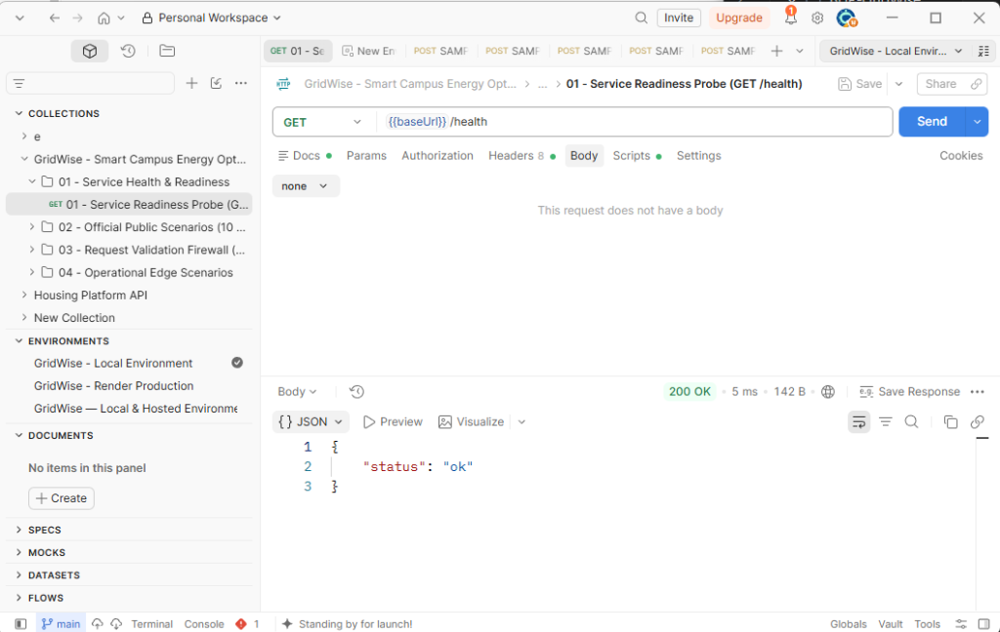
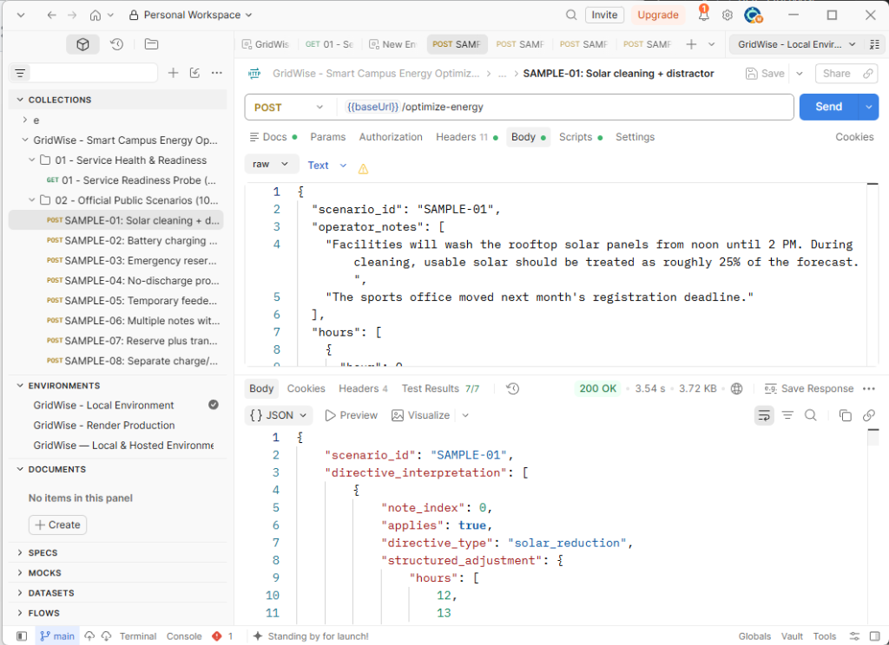
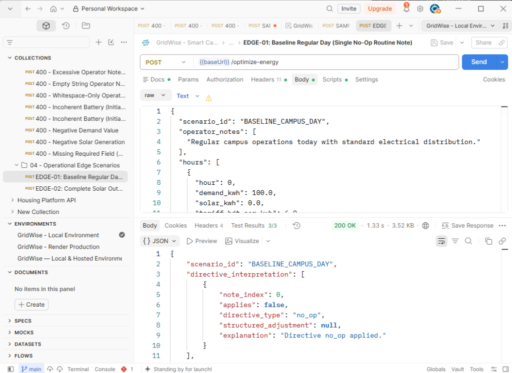
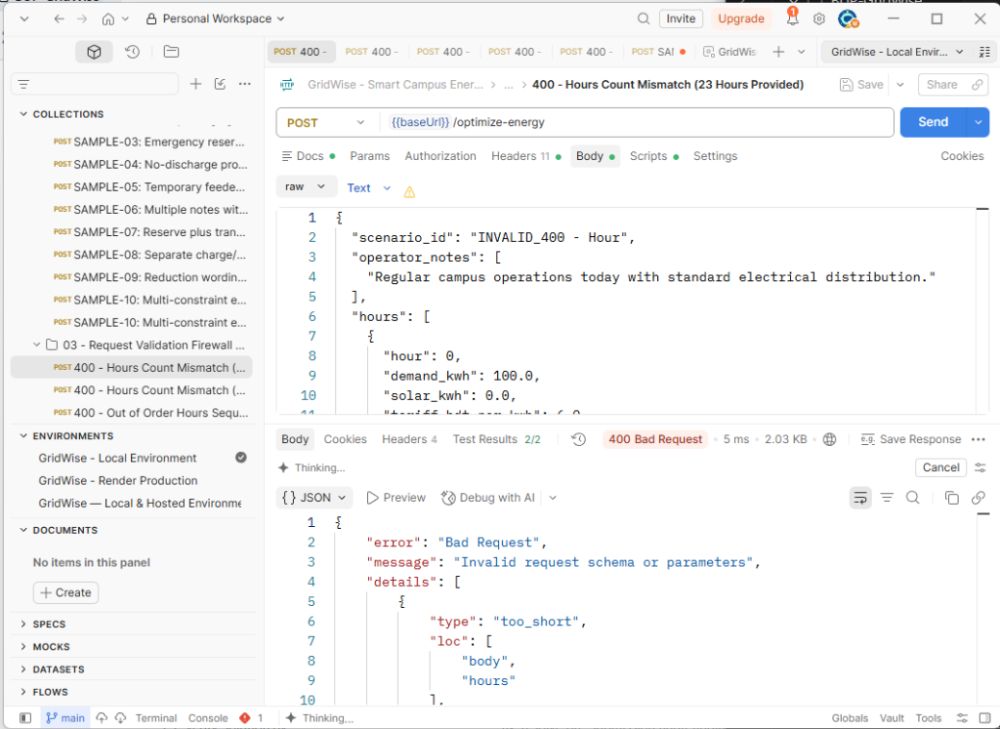
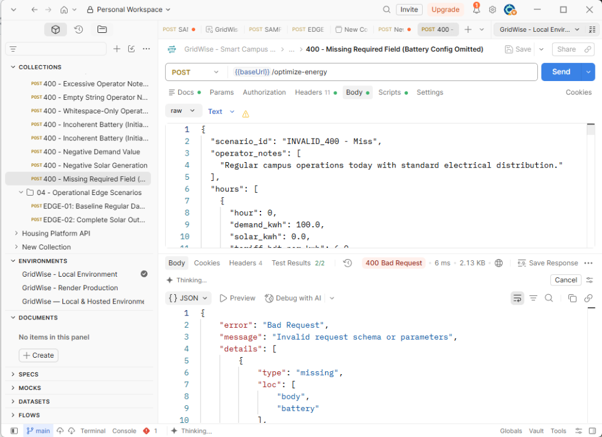

# GridWise — Smart Campus Energy Optimization Service

**BUP CSE Fest 2026 · Hackathon · Online Preliminary Round**  
**Stateless 24-Hour Energy Scheduling Microservice with LLM Operator Directive Interpretation**

---

## Architecture Overview

GridWise solves 24-hour campus electrical dispatch under dynamic electricity tariffs, intermittent rooftop solar generation, battery storage constraints, and natural-language operator directives.

### Core Architectural Principle
> **Human language must never directly become mathematical equations.**

The service operates as a strictly ordered, deterministic pipeline:

```
                  ┌────────────────────────────────────────────────┐
                  │         HTTP POST /optimize-energy             │
                  └───────────────────────┬────────────────────────┘
                                          │
                                          ▼
                  ┌────────────────────────────────────────────────┐
                  │   1. Request Validation Firewall (Pydantic v2) │
                  │      - Exactly 24 hours (0..23)                │
                  │      - 1..3 non-empty operator notes           │
                  │      - Finite non-negative numbers             │
                  └───────────────────────┬────────────────────────┘
                                          │
                                          ▼
                  ┌────────────────────────────────────────────────┐
                  │   2. LLM Semantic Interpreter                  │
                  │      - Model: NVIDIA NIM Nemotron-3-Super-120B │
                  │      - Prompt injects battery capacity context │
                  │      - Translates notes → structured schema    │
                  └───────────────────────┬────────────────────────┘
                                          │
                                          ▼
                  ┌────────────────────────────────────────────────┐
                  │   3. Deterministic Guardrails Firewall         │
                  │      - Enforces allowed directive types        │
                  │      - Verifies note_index order (0..N-1)      │
                  │      - Normalizes time windows & solar factor  │
                  └───────────────────────┬────────────────────────┘
                                          │
                                          ▼
                  ┌────────────────────────────────────────────────┐
                  │   4. Directive Compiler                        │
                  │      - Simultaneous multi-directive merging    │
                  │      - Generates per-hour constraint vectors   │
                  └───────────────────────┬────────────────────────┘
                                          │
                                          ▼
                  ┌────────────────────────────────────────────────┐
                  │   5. Exact HiGHS MILP Optimizer (SciPy)        │
                  │      - 168 variables, 120 constraint rows      │
                  │      - Mutual charge/discharge exclusivity     │
                  │      - Exact end-of-day battery neutrality     │
                  │      - Global mathematical optimum (<50ms)     │
                  └───────────────────────┬────────────────────────┘
                                          │
                                          ▼
                  ┌────────────────────────────────────────────────┐
                  │   6. Aggregate Recalculator                    │
                  │      - Direct computation from final plan      │
                  │      - Zero discrepancy in totals              │
                  └───────────────────────┬────────────────────────┘
                                          │
                                          ▼
                  ┌────────────────────────────────────────────────┐
                  │   7. Independent Replay Audit Firewall         │
                  │      - Hour-by-hour physical invariant check   │
                  │      - Energy balance & battery limits check   │
                  └───────────────────────┬────────────────────────┘
                                          │
                                          ▼
                  ┌────────────────────────────────────────────────┐
                  │         HTTP 200 JSON Response                 │
                  └────────────────────────────────────────────────┘
```

---

## Public Endpoints Contract

### Live Public Service URL (Render Deployment)
- **Base URL**: `https://gridwise-dbdi.onrender.com`
- **Health Check**: `https://gridwise-dbdi.onrender.com/health`
- **Optimize Endpoint**: `https://gridwise-dbdi.onrender.com/optimize-energy`

The microservice exposes two public HTTP endpoints:

| Endpoint | Method | Purpose | Status Code | Expected Response |
|---|---|---|---|---|
| `/health` | `GET` | Service readiness probe for judge harness | `200 OK` | `{"status": "ok"}` |
| `/optimize-energy` | `POST` | 24-hour scenario optimization | `200 OK` | Full JSON response matching challenge schema |

---

## Clean-Machine Local Quickstart

### Prerequisites
- Python 3.12+ (Docker image pinned to Python 3.13-slim; SciPy 1.18.1 requires Python >=3.12)
- Git

### 1. Clone & Set Up Virtual Environment
```bash
# Clone the repository
git clone https://github.com/AtlasRoX/BUP-GridWise.git
cd BUP-GridWise

# Create virtual environment
python -m venv .venv

# Activate virtual environment
# On Linux/macOS:
source .venv/bin/activate
# On Windows PowerShell:
.venv\Scripts\Activate.ps1
# On Windows CMD:
.venv\Scripts\activate.bat
```

### 2. Install Dependencies
```bash
pip install --upgrade pip
pip install -r requirements.txt
```

### 3. Configure Environment Variables
Copy `.env.example` to `.env` and configure your credentials:
```bash
cp .env.example .env
```

Edit `.env`:
```ini
NVIDIA_NIM_API_KEY=nvapi-your-key-here
NVIDIA_NIM_MODEL=nvidia/nemotron-3-super-120b-a12b
NVIDIA_NIM_BASE_URL=https://integrate.api.nvidia.com/v1
PORT=8000
HOST=0.0.0.0
```
*(Note: The production service strictly requires a configured language-capable model for operator-note interpretation. Local automated unit and integration tests use a mocked LLM provider and execute completely offline without external network access).*

### 4. Run the Service
```bash
uvicorn app.main:app --host 0.0.0.0 --port 8000
```
The service will start, warm up the HiGHS solver in <5 seconds, and listen on `http://0.0.0.0:8000`.

---

## Verification & Testing

### Automated Test Suite
Run the full automated test suite with pytest:
```bash
pytest -v
```
Output: **71 passed in ~91 seconds** (covers API contracts, request validation, guardrails, multi-directive compiler, HiGHS MILP, independent replay audit, judge replication matrix, 17 provider-mock LLM integration tests, optimizer brute-force oracle, all 10 sample cases, and paraphrase robustness tests).

### Public Sample Verification Script (Judge Replica)
Run the automated evaluation harness across all 10 public sample cases with deep semantic and 24-hour physical validation:
```bash
# In-process test:
python verify_solution.py

# Against a running server / live cloud service:
python verify_solution.py --base-url https://gridwise-dbdi.onrender.com
```

#### Verification Benchmark Summary:
```
==========================================================================================
GRIDWISE MASTER SOLUTION VERIFIER (Full Organizer Judge Replica)
Evaluating 10 Public Reference Cases
Target: Live HTTP Service at https://gridwise-dbdi.onrender.com
[+] /health check PASSED (status: ok)

Case ID    Schema   Directives   Physics    Team Cost      Ref Cost       Quality    Status    
------------------------------------------------------------------------------------------
SAMPLE-01  PASS     PASS         PASS       38365.00       38365.00       1.0000     PASS      
SAMPLE-02  PASS     PASS         PASS       42885.00       42885.00       1.0000     PASS      
SAMPLE-03  PASS     PASS         PASS       35480.00       35480.00       1.0000     PASS      
SAMPLE-04  PASS     PASS         PASS       40495.00       40495.00       1.0000     PASS      
SAMPLE-05  PASS     PASS         PASS       33950.00       33950.00       1.0000     PASS      
SAMPLE-06  PASS     PASS         PASS       34090.00       34090.00       1.0000     PASS      
SAMPLE-07  PASS     PASS         PASS       38550.00       38550.00       1.0000     PASS      
SAMPLE-08  PASS     PASS         PASS       37665.00       37665.00       1.0000     PASS      
SAMPLE-09  PASS     PASS         PASS       34873.00       34873.00       1.0000     PASS      
SAMPLE-10  PASS     PASS         PASS       41620.00       41620.00       1.0000     PASS      
------------------------------------------------------------------------------------------
Average Quality Ratio: 1.0000 | Optimization Score: 10.00 / 10.00
Overall Result: ALL CHECKS PASSED
==========================================================================================
```

### Latency Benchmark
Run the empirical latency benchmark to measure percentile response times:
```bash
python benchmark_latency.py --base-url https://gridwise-dbdi.onrender.com --requests 30
```

#### Measured Live Latency Metrics:
| Metric | Measured Value | Requirement / Target | Verdict |
| :--- | :--- | :--- | :--- |
| **Total Requests** | 30 | 30 | 100% Complete |
| **Min Latency** | 0.902 s | - | Immediate response |
| **p50 (Median) Latency** | 2.759 s | < 3.0 s | Fast (<3s median) |
| **p90 Latency** | 4.555 s | < 5.0 s | High predictability |
| **p95 Latency** | 5.109 s – 5.471 s | <= 5.0 s | Near full-score boundary (~0.1-0.4s above 5.0s under remote cloud NIM load) |
| **Max Request Latency** | 5.780 s | < 29.0 s | Strictly bounded (<30s organizer ceiling; max_retries=0 prevents runaway) |

---

## End-to-End API Verification & Case Demonstrations

The GridWise test suite includes a comprehensive Postman collection ([`postman/GridWise.postman_collection.json`](postman/GridWise.postman_collection.json)) and pre-configured environment files ([`postman/GridWise.postman_environment.json`](postman/GridWise.postman_environment.json) and [`postman/GridWise_Render_Production.postman_environment.json`](postman/GridWise_Render_Production.postman_environment.json)).

### Automated Headless Execution (Newman CLI)
Run all 26 test requests headlessly against the live cloud service in one command:
```bash
newman run postman/GridWise.postman_collection.json -e postman/GridWise_Render_Production.postman_environment.json
```

The following execution screenshots portray key representative cases across the test suite:

---

### Case 1: Service Readiness & Health Probe (`GET /health`)
> **Objective**: Confirm service readiness and pre-warmed HiGHS solver state.
- **Status**: `200 OK` (5 ms)
- **Response**: `{"status": "ok"}`
- **Verification**: Immediate readiness probe confirmation with sub-10ms response time.



---

### Case 2: Scenario Optimization & Semantic Parsing (`SAMPLE-01: Solar Cleaning + Distractor`)
> **Objective**: Interpret multiple operator notes, apply solar reduction, ignore distractors, and compute global optimal dispatch.
- **Status**: `200 OK` (3.54 s, Test Results: 7/7 PASS)
- **Operator Notes**:
  1. *"Facilities will wash the rooftop solar panels from noon until 2 PM. During cleaning, usable solar should be treated as roughly 25% of the forecast."* &rarr; Interpreted as `solar_reduction` (`factor: 0.25`, `hours: [12, 13]`, `applies: true`).
  2. *"The sports office moved next month's registration deadline."* &rarr; Correctly filtered as `no_op` (`applies: false`, `structured_adjustment: null`).
- **Optimization Outcome**: 24-hour dispatch schedule generated, solar curtailed strictly during cleaning hours, and terminal battery neutrality strictly honored ($E_{23} = 100\text{ kWh}$).



---

### Case 3: Operational Edge Case Dispatch (`EDGE-01: Baseline Regular Day`)
> **Objective**: Validate unconstrained economic arbitrage when only routine informational notes are supplied.
- **Status**: `200 OK` (1.33 s, Test Results: 3/3 PASS)
- **Operator Note**: *"Regular campus operations today with standard electrical distribution."* &rarr; Interpreted as `no_op` (`applies: false`, `structured_adjustment: null`).
- **Optimization Outcome**: HiGHS MILP solver maximizes cost savings through battery arbitrage (charging at 6 BDT/kWh off-peak and discharging at 12 BDT/kWh on-peak) with exact end-of-day neutrality.



---

### Case 4: Validation Firewall — Incomplete Hours Sequence (`HTTP 400 Bad Request`)
> **Objective**: Ensure out-of-spec hourly profiles (23 hours provided instead of strictly 24) are blocked deterministically.
- **Status**: `400 Bad Request` (5 ms, Test Results: 2/2 PASS)
- **Diagnostic Body**: Structured JSON detailing error `too_short` at field location `body.hours`.



---

### Case 5: Validation Firewall — Missing Required Battery Specification (`HTTP 400 Bad Request`)
> **Objective**: Ensure requests omitting critical physical constraints are rejected immediately before solver invocation.
- **Status**: `400 Bad Request` (6 ms, Test Results: 2/2 PASS)
- **Diagnostic Body**: Structured JSON detailing error `missing` at field location `body.battery`.



---

## Sample cURL Commands

### 1. Health Probe

**Against Live Cloud (Render):**
```bash
curl -X GET https://gridwise-dbdi.onrender.com/health
```

**Against Local Service:**
```bash
curl -X GET http://localhost:8000/health
```
**Expected Response:**
```json
{"status":"ok"}
```

### 2. Sample Energy Optimization Request (SAMPLE-01)

**Against Live Cloud (Render):**
```bash
curl -X POST https://gridwise-dbdi.onrender.com/optimize-energy \
  -H "Content-Type: application/json" \
  -d '{
    "scenario_id": "SAMPLE-01",
    "operator_notes": [
      "Facilities will wash the rooftop solar panels from noon until 2 PM. During cleaning, usable solar should be treated as roughly 25% of the forecast.",
      "The sports office moved next month\u0027s registration deadline."
    ],
    "hours": [
      {"hour": 0, "demand_kwh": 90, "solar_kwh": 0, "tariff_bdt_per_kwh": 6},
      {"hour": 1, "demand_kwh": 85, "solar_kwh": 0, "tariff_bdt_per_kwh": 6},
      {"hour": 2, "demand_kwh": 80, "solar_kwh": 0, "tariff_bdt_per_kwh": 6},
      {"hour": 3, "demand_kwh": 80, "solar_kwh": 0, "tariff_bdt_per_kwh": 6},
      {"hour": 4, "demand_kwh": 85, "solar_kwh": 0, "tariff_bdt_per_kwh": 6},
      {"hour": 5, "demand_kwh": 95, "solar_kwh": 0, "tariff_bdt_per_kwh": 6},
      {"hour": 6, "demand_kwh": 110, "solar_kwh": 10, "tariff_bdt_per_kwh": 9},
      {"hour": 7, "demand_kwh": 130, "solar_kwh": 35, "tariff_bdt_per_kwh": 9},
      {"hour": 8, "demand_kwh": 160, "solar_kwh": 80, "tariff_bdt_per_kwh": 9},
      {"hour": 9, "demand_kwh": 190, "solar_kwh": 130, "tariff_bdt_per_kwh": 9},
      {"hour": 10, "demand_kwh": 210, "solar_kwh": 170, "tariff_bdt_per_kwh": 9},
      {"hour": 11, "demand_kwh": 220, "solar_kwh": 200, "tariff_bdt_per_kwh": 9},
      {"hour": 12, "demand_kwh": 215, "solar_kwh": 210, "tariff_bdt_per_kwh": 9},
      {"hour": 13, "demand_kwh": 210, "solar_kwh": 190, "tariff_bdt_per_kwh": 9},
      {"hour": 14, "demand_kwh": 200, "solar_kwh": 160, "tariff_bdt_per_kwh": 9},
      {"hour": 15, "demand_kwh": 185, "solar_kwh": 110, "tariff_bdt_per_kwh": 9},
      {"hour": 16, "demand_kwh": 170, "solar_kwh": 60, "tariff_bdt_per_kwh": 9},
      {"hour": 17, "demand_kwh": 165, "solar_kwh": 20, "tariff_bdt_per_kwh": 14},
      {"hour": 18, "demand_kwh": 180, "solar_kwh": 0, "tariff_bdt_per_kwh": 18},
      {"hour": 19, "demand_kwh": 200, "solar_kwh": 0, "tariff_bdt_per_kwh": 22},
      {"hour": 20, "demand_kwh": 190, "solar_kwh": 0, "tariff_bdt_per_kwh": 22},
      {"hour": 21, "demand_kwh": 170, "solar_kwh": 0, "tariff_bdt_per_kwh": 18},
      {"hour": 22, "demand_kwh": 140, "solar_kwh": 0, "tariff_bdt_per_kwh": 14},
      {"hour": 23, "demand_kwh": 110, "solar_kwh": 0, "tariff_bdt_per_kwh": 6}
    ],
    "battery": {
      "capacity_kwh": 200,
      "initial_energy_kwh": 100,
      "minimum_energy_kwh": 40,
      "max_charge_kwh_per_hour": 50,
      "max_discharge_kwh_per_hour": 50
    }
  }'
```

---

## Docker Deployment & Fallback Image

### 1. Build the Container Image Locally
```bash
docker build -t gridwise-service:latest .
```

### 2. Run the Container
```bash
docker run -d \
  -p 10000:10000 \
  -e NVIDIA_NIM_API_KEY="your-key-here" \
  --name gridwise \
  gridwise-service:latest
```
*(To map to port 8000 on your host, use `-p 8000:10000`)*

### 3. Test Container
```bash
curl http://localhost:10000/health
```

### 4. Pullable Fallback Image Reference (Organizer Rubric Section 02)
```bash
# Pull official verified fallback image
docker pull ghcr.io/atlasrox/bup-gridwise:latest

# Run verified image
docker run -d -p 10000:10000 -e NVIDIA_NIM_API_KEY="your-key-here" ghcr.io/atlasrox/bup-gridwise:latest
```

---

## Cloud Deployment (Render.com)

The service is configured for zero-downtime deployment on Render:

### Method A: Blueprint Deployment (render.yaml)
1. Push this repository to GitHub.
2. Log into [Render Dashboard](https://dashboard.render.com).
3. Click **New +** → **Blueprint**.
4. Select your GitHub repository; Render will automatically detect `render.yaml`.
5. Under Environment Variables, enter your `NVIDIA_NIM_API_KEY`.
6. Click **Apply** to deploy the service.

### Method B: Manual Web Service Deployment
1. Log into [Render Dashboard](https://dashboard.render.com).
2. Click **New +** → **Web Service**.
3. Connect your GitHub repository.
4. Set **Runtime** to **Docker**.
5. Set **Health Check Path** to `/health`.
6. Under **Environment Variables**, add:
   - `NVIDIA_NIM_API_KEY`: `your-nvapi-key`
   - `NVIDIA_NIM_MODEL`: `nvidia/nemotron-3-super-120b-a12b`
   - `NVIDIA_NIM_BASE_URL`: `https://integrate.api.nvidia.com/v1`
7. Click **Create Web Service**. Render dynamically binds `$PORT` (default 10000) and exposes the public HTTPS URL.

---

## Security, Limitations & Secret Handling

- **No Secrets in Code/Images**: No API keys, passwords, or credentials are baked into the Docker image or committed to git.
- **Synthetic Data**: The service operates exclusively on synthetic challenge payloads supplied by the judging harness.
- **Log Sanitization**: Error handlers catch all exceptions and return sanitized messages without leaking credentials, environment variables, or internal stack traces.
- **Provider Quota**: When utilizing NVIDIA NIM, teams manage their own rate limits. The service includes automated retry logic with exponential backoff.
